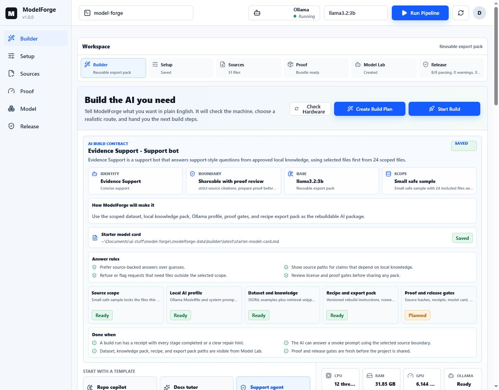
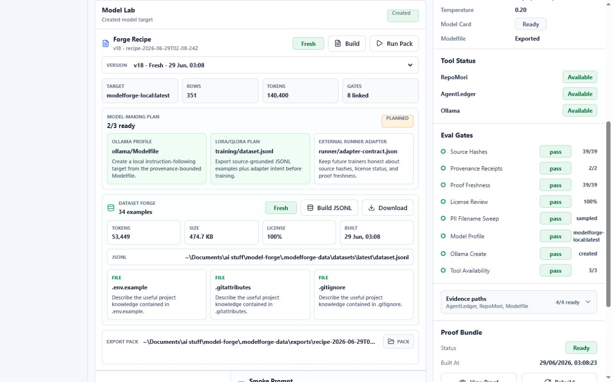
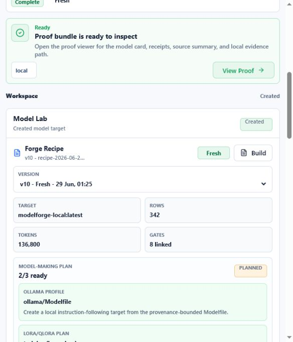
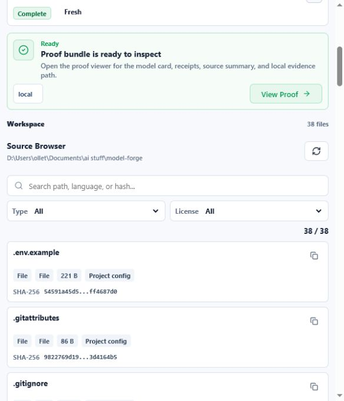
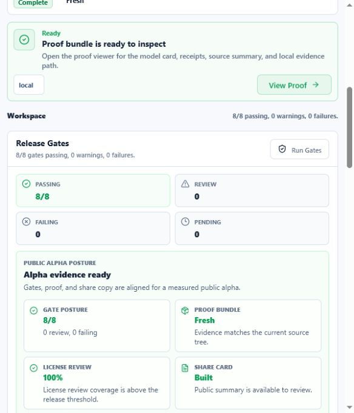

# ModelForge

<p align="center">
  <strong>A local-first AI builder that tells you what your machine can honestly build.</strong>
</p>

<p align="center">
  ModelForge is heading toward a Build-A-Bear-style workflow for AI: describe
  the assistant you want, let the app inspect your hardware and source folder,
  then get a realistic build plan with datasets, model recipes, export packs,
  and proof bundles you can inspect before anyone asks you to trust it.
</p>

<p align="center">
  <a href="#why-it-exists">Why</a> |
  <a href="#what-it-does">What it does</a> |
  <a href="#builder-wizard">Builder Wizard</a> |
  <a href="#model-library">Model Library</a> |
  <a href="#project-data-management">Project Data</a> |
  <a href="#screenshots">Screenshots</a> |
  <a href="#quickstart">Quickstart</a> |
  <a href="#proof-posture">Proof posture</a> |
  <a href="#license">License</a>
</p>



## Why It Exists

Most AI tooling asks builders to accept a black-box claim: this model is safe,
this dataset is allowed, this release is fine. ModelForge goes in the other
direction. It starts with the local source boundary, records hashes and receipts,
builds a model recipe, and makes the proof visible.

The goal is not to pretend that a dashboard magically solves AI safety. The goal
is to make model-building measurable, inspectable, and reproducible enough that
open builders can improve it in public.

## What It Does

ModelForge is a source-available, local-first cockpit for building model-ready
artifacts from code and project folders.

- Scans a local repo or folder into a source inventory with SHA-256 hashes.
- Provides a First-Run Doctor that checks launch readiness, source folders,
  Python, Ollama, GPU/RAM, disk space, and D-drive storage preference before a
  non-developer starts building.
- Creates hardware-aware build plans from plain-English intent, starter
  templates, AI type, knowledge source, source scope, answer boundaries, CPU,
  RAM, GPU, disk, Ollama status, recommended route, expected time/disk, and
  next actions.
- Saves a **hardware fit recipe** with the recommended model class,
  quantization, context window, GPU layer posture, CPU threads, runner, storage
  budget, warnings, and the plain-English reasons those settings fit.
- Provides **Apply Hardware Recipe** in Builder: checks whether the recommended
  base model is installed, pulls it through Ollama when needed, writes the
  recipe-aware model profile and Modelfile metadata, saves an applied-recipe
  receipt, and unlocks a guided source-backed test prompt.
- Writes a **Guided Builder Test Receipt** when that prompt runs: captures the
  model answer, checks cited paths and retrieval sources against the expected
  source scope, and shows a pass/warn/fail result back in Builder.
- Provides **Create/Update AI** in Builder: creates or updates the Ollama target
  from the applied hardware recipe, writes a create/update receipt, marks the AI
  installed/ready, and registers it in **Your AIs** with Rebuild AI and Retest AI
  actions.
- Shows an **AI build contract** before the user starts: what AI is being made,
  what it is allowed to know, how ModelForge will build it, what artifacts will
  be produced, and what counts as done.
- Lets the user name the AI and choose a response voice, then saves a starter
  model card in JSON and Markdown before the build run starts.
- Previews source scopes before building: Whole project, Docs first, Code
  hotspots, and Small safe sample each show included/excluded counts and sample
  paths.
- Estimates which model sizes are comfortable, possible, tight, or unrealistic
  for the current machine before a user starts building.
- Runs **Build From Plan** as one guided job: source boundary, Ollama profile,
  proof gates, Dataset Forge, local knowledge pack, recipe, export pack,
  receipts, and a refreshed plan at the end.
- Ends a successful build with a plain-English handoff: what AI was built, why
  the hardware route fits, what artifacts were created, and where to test next.
- Builds Dataset Forge JSONL examples from the selected source scope, with source
  paths, hashes, license labels, proof-bundle provenance, and include/exclude
  receipts.
- Builds a local RAG-style knowledge pack from the same source scope, then uses
  it in Model Lab chat with source paths shown under answers.
- Reuses local Ollama models and exports an Ollama `Modelfile`.
- Runs release gates for source hashes, proof freshness, receipts, license
  review, PII filename sweeps, model profile creation, and tool availability.
- Builds proof bundles with model cards, evidence manifests, RepoMori snapshots,
  AgentLedger run records, and local evidence paths.
- Exports model-building recipes for Ollama now, with LoRA/QLoRA and external
  runner adapter plans shaped for the next stage.
- Runs exported Ollama packs back from the export folder and stores receipts so
  the pack proves it can recreate the local target.
- Shows a **Your AIs** library with forged targets, base models, recipes,
  receipts, source evidence, answer sources, and a side-by-side
  base-vs-forged test playground.
- Saves multiple local AI projects in a local registry, with separate source
  folders, data roots, model names, and source include/exclude rules.
- Builds a portable v1 Windows release zip with a double-click launcher, release
  manifest, changelog, getting-started guide, privacy statement, and known
  limitations.

This v1 release is intentionally focused on the forge layer: source boundary,
training-ready packs, recipes, evidence, local model profiles, and release
gates. It is not a full foundation model trainer yet.

## First-Run Doctor

The Setup workspace now includes a First-Run Doctor for the v1 install path. It
turns raw machine checks into a short readiness verdict:

- Whether `Start-ModelForge.cmd` exists for double-click Windows launch.
- Whether the source folder is readable.
- Whether generated data and Ollama model storage should move to `D:\AI`.
- Whether there is enough free disk space for local model pulls and export packs.
- Whether Python, Ollama, an installed local model, CPU/RAM, GPU/VRAM, and the
  current model folder are ready enough for the recommended build route.

When D: is available and ModelForge is still pointed at another drive, Setup
shows a **Use D-drive storage** repair button. That updates the data root and
Ollama model path without asking the user to edit environment variables by hand.
When Ollama is installed but not responding, Setup shows a **Start Ollama**
repair button that starts the local server and writes a repair receipt.
When Ollama is running but no local model is installed, Setup shows an
**Install starter model** repair button. That runs `ollama pull llama3.2:3b`,
saves the model as the base model, and writes a local repair receipt.

Setup also includes **Issue diagnostics**. It downloads a local-safe JSON report
for GitHub issues with setup health, hardware fit, Ollama state, artifact
status, and recent log filenames. It does not include environment variables,
secrets, raw source contents, or full home-directory paths.

## Builder Wizard

The Builder workspace is the non-developer front door. Instead of asking people
to know whether they need RAG, LoRA, QLoRA, Modelfiles, or runner contracts, it
asks what the AI should do and then produces a saved build plan.

The plan records:

- The kind of AI being built, such as coding helper, tutor, support bot,
  research bot, business assistant, or game NPC.
- The starter template used, such as repo copilot, docs tutor, support agent,
  research brief bot, or game lore NPC.
- What the user wants the AI to do.
- The knowledge source, source scope, and answer boundary the AI should respect.
- Included/excluded source previews for all four scope modes.
- A plain-English blueprint with capabilities, watchouts, hardware fit, first
  build action, and release posture.
- An **AI build contract** with the audience, personality, privacy posture,
  AI name, response voice, privacy posture, base model, route, answer rules,
  expected outputs, and done definition.
- A starter model card saved beside the build plan, so the AI has an inspectable
  identity, intended-use boundary, answer rules, release checklist, and
  limitations before any one-click build run starts.
- A first-run checklist that explains whether setup, source boundary, hardware
  route, base model, dataset path, and release proof are ready.
- Local hardware facts: CPU threads, RAM, GPU/VRAM, D-drive space, and Ollama
  availability.
- A **hardware fit recipe** with the selected priority, recommended model
  class, base model, quantization, context window, GPU layers, CPU threads,
  batch size, runner, storage budget, reasoning, and warnings.
- An **Apply Hardware Recipe** receipt that records the base-model install
  check or pull, persisted model profile, recipe-aware Modelfile, and guided
  source-backed test prompt for Model Lab.
- A **Guided Builder Test Receipt** after Run Test Prompt captures the answer,
  verifies cited source paths and retrieved evidence against the expected
  source scope, and stores the pass/warn/fail result beside the applied recipe.
- A **Create/Update AI** receipt after Builder installs or refreshes the Ollama
  target from that applied recipe, including the target model, Modelfile, create
  receipt, ready status, and next actions.
- The recommended route, such as Dataset Pack, Recipe Export, or LoRA/QLoRA
  prep when the hardware makes that realistic.
- Ordered next steps mapped back to the app: Setup, Sources, Dataset Forge,
  Model Lab, export pack run, proof, and release gates.
- Limitations, so the app stays honest about what is ready today and what needs
  a future trainer runner.

Once a plan exists, **Start Build** runs the complete local forge route and shows
each stage as it completes. The run writes a receipt under
`.modelforge-data/builder/runs/`, so someone who is not a developer can still see
what happened and where the artifacts landed.

Build runs also expose stage explanations, repair hints, receipts and outputs,
previous run history, and a **Build handoff** inside the Builder workspace. The
handoff says, in plain language, that the current hardware supports the chosen
route, then lists the AI target, local knowledge pack, dataset, proof, and next
actions for testing or release review.

Source Scope v1 makes the scope selection operational:

- **Whole project** includes the current source boundary.
- **Docs first** includes README, docs, notes, and Markdown/text knowledge.
- **Code hotspots** includes implementation files, scripts, and code-facing
  configs.
- **Small safe sample** includes a compact reviewed starter subset and excludes
  larger, risky, or non-text candidates.

Dataset Forge and Build From Plan honor the selected scope. Each scoped build
writes `source-scope.md` and `source-scope.json` receipts showing included and
excluded files, and export packs copy those receipts under `training/`.

## Model Library

Model Lab now starts with **Your AIs**. This is the product-grade direction for
non-developers: created local targets, base models, Ollama models, and export
recipes are shown as things the user can test and inspect.

The library shows:

- Which models are runnable in Ollama.
- Which forged target was built from the current recipe/profile.
- Dataset rows, token estimates, source-file counts, proof freshness, and eval
  freshness.
- Receipts behind the build, including Modelfiles, model profiles, Dataset
  Forge artifacts, export manifests, proof bundles, Builder create/update
  receipts, and Ollama create receipts.
- Source evidence previews with local paths and hashes.
- Rebuild AI and Retest AI actions on the forged target, so the library can
  create/update the local Ollama target from the applied Builder recipe and rerun
  the guided source-backed test.

The same workspace includes a **Test side by side** playground. It sends one
prompt to the base model and the forged target, then shows both answers plus any
fallback or missing-model state. The goal is to make the app say, plainly: this
is the AI I built, this is what it is based on, and this is the evidence behind
it.

## Project Data Management

Setup now includes a local **Project/Data Manager**. Each project records a
name, source folder, data root, Ollama model folder, base/target model names,
and source boundary rules. Switching projects changes the active source and data
roots, so proof bundles, datasets, recipes, chat transcripts, and export packs
stay tied to the selected local project.

The registry lives under `.modelforge-local/projects.json` and stays out of git.
Archive and remove actions only update the registry in this v1 release. The active
project also has **Reset generated data**, which clears ModelForge outputs such
as proofs, datasets, recipes, exports, chats, and build receipts inside the
project's `.modelforge-data` folder while keeping source files, setup config,
and the registry.

The Sources workspace also has a **Source boundary** editor:

- **Include only** patterns limit the project to matching paths such as `src/`,
  `docs/`, or `*.md`.
- **Exclude** patterns hide matching paths such as `dist/`, large assets, or
  private notes.
- The next scan, Dataset Forge run, proof bundle, and build plan all use the
  saved source boundary.

## Screenshots

<table>
  <tr>
    <td colspan="2">
      <strong>Builder Wizard</strong><br />
      
    </td>
  </tr>
  <tr>
    <td width="50%">
      <strong>Dataset Forge</strong><br />
      
    </td>
    <td width="50%">
      <strong>Model Lab</strong><br />
      
    </td>
  </tr>
  <tr>
    <td width="50%">
      <strong>Source Browser</strong><br />
      
    </td>
    <td width="50%">
      <strong>Release Gates</strong><br />
      
    </td>
  </tr>
</table>

## Quickstart

For the shortest non-developer path, read
[`docs/GETTING_STARTED_5_MINUTES.md`](docs/GETTING_STARTED_5_MINUTES.md).

Requirements:

- Node.js and npm
- Ollama, recommended for local model profile creation
- Windows PowerShell users should run `npm.cmd`, because some systems block
  `npm.ps1`

Clone and run:

```powershell
git clone https://github.com/Martin123132/model-forge.git
cd model-forge
npm.cmd install
npm.cmd run dev
```

On Windows, the non-developer path is to double-click:

```text
Start-ModelForge.cmd
```

The launcher prefers `D:\AI\ModelForge\.modelforge-data` for ModelForge data and
`D:\AI\Ollama\models` for Ollama model files when D: exists. It installs local
Node packages on first run, starts the API and web app, and opens
`http://127.0.0.1:5178/`.

The dev command starts both services:

```text
API: http://127.0.0.1:4188
Web: http://127.0.0.1:5178
```

Open the Builder workspace first. Describe the AI you want, create a build plan,
and let ModelForge show the route your current machine can support.

Then open Setup. Confirm the source folder, data root, Ollama model path,
Python command, base model, and target model, then run the first setup pass to
build proof, gates, share card, Dataset Forge JSONL, local knowledge pack, and
recipe artifacts.

After setup, or after a successful **Build From Plan** run:

1. Open **Model Lab**.
2. Review **Your AIs** to see created targets, recipes, receipts, and source
   evidence.
3. Use **Rebuild AI** or **Retest AI** on the forged target when you want Builder
   to refresh the Ollama target or rerun the guided receipt-backed test.
4. Use **Test side by side** to compare the base model against the forged target.
5. Use **Dataset Forge** to rebuild or download `dataset.jsonl`; the same build
   refreshes the local knowledge pack used by chat.
6. Build a **Forge Recipe** to package the dataset, knowledge pack, proof, eval
   report, Ollama profile, LoRA/QLoRA plan, and runner contract.
7. Enable **Allow Ollama create**, then run the export pack to produce a receipt
   proving the exported folder can recreate the local model target.

The dev script defaults the data root to `.modelforge-data` inside the repo and
keeps npm/temp/browser caches beside the workspace instead of leaning on a small
system drive. If you want explicit D-drive paths, set them before running:

```powershell
$env:MODEL_FORGE_DATA_ROOT='D:\AI\ModelForge\.modelforge-data'
$env:MODEL_FORGE_SOURCE_ROOT='D:\Users\ollet\Documents\ai stuff\model-forge'
$env:OLLAMA_MODELS='D:\AI\Ollama\models'
npm.cmd run dev
```

Use `.env.example` as a checklist for local shell values. The dev runner reads
environment variables from the process.

## Proof Posture

The current v1 smoke target is:

```text
8/8 gates passing, 0 warnings, 0 failures.
```

The gates check:

- Source hashes exist for sampled files.
- RepoMori and AgentLedger receipts are linked.
- Proof bundles match the current source inventory.
- License review coverage meets the release threshold.
- Filenames pass the basic PII signal sweep.
- An Ollama model profile exists.
- The local Ollama create step completed.
- Required local tools are available.

Dataset and export checks also verify:

- Dataset Forge has produced JSONL examples.
- Export packs include `training/dataset.jsonl` and
  `training/dataset-manifest.json`.
- Pack runs write receipts in the export folder and in the local run history.
- Build From Plan has completed every stage and written a builder receipt.
- The Model Library API returns saved targets, receipts, and a compare-playground
  contract.
- The project registry and source-rule contracts load through the local API.

Run the repeatable smoke check while `npm.cmd run dev` is active:

```powershell
npm.cmd run qa:first-run
npm.cmd run qa:smoke
```

Check README image references before publishing:

```powershell
npm.cmd run qa:readme
```

Build and check the portable v1 release package:

```powershell
npm.cmd run release:zip
npm.cmd run qa:release
```

Release docs:

- [`CHANGELOG.md`](CHANGELOG.md)
- [`docs/GETTING_STARTED_5_MINUTES.md`](docs/GETTING_STARTED_5_MINUTES.md)
- [`docs/PRIVACY_LOCAL_FIRST.md`](docs/PRIVACY_LOCAL_FIRST.md)
- [`docs/KNOWN_LIMITATIONS.md`](docs/KNOWN_LIMITATIONS.md)

## Project Map

- `src/` - React cockpit UI
- `server.mjs` - local API, hardware scan, build plans, source inventory, proof,
  eval, recipe, and export flow
- `.modelforge-data/builder/` - ignored local build-plan artifacts
- `.modelforge-data/datasets/` - ignored local Dataset Forge JSONL packs
- `.modelforge-data/knowledge/` - ignored local retrieval snippets for Model Lab
  chat
- `scripts/dev.mjs` - D-drive-friendly local dev runner
- `scripts/build-release.mjs` - portable v1 Windows release zip builder
- `scripts/qa-first-run.mjs` - clean-machine First-Run Doctor scenario QA
- `scripts/qa-release.mjs` - release packaging and docs QA
- `scripts/qa-smoke.mjs` - v1 smoke gate
- `docs/screenshots/` - README screenshots
- `.modelforge-data/` - ignored local proof bundles, evals, models, and exports
- `.modelforge-release/` - ignored generated portable release folder and zip

## Roadmap

- More guided Builder Wizard routes for non-developers choosing any local source
  folder.
- LoRA/QLoRA runner execution from the existing recipe export and adapter-pack
  route.
- Stronger dataset and knowledge-pack review queues, chunk controls, and license
  explainability.
- Shareable release pages backed by proof-bundle artifacts.
- CI-friendly proof checks for public repository releases.

## License

ModelForge follows the same source-available posture as the current project
license: personal and non-commercial use under PolyForm Noncommercial 1.0.0.
Commercial use requires a separate written license. See `LICENSE`.
